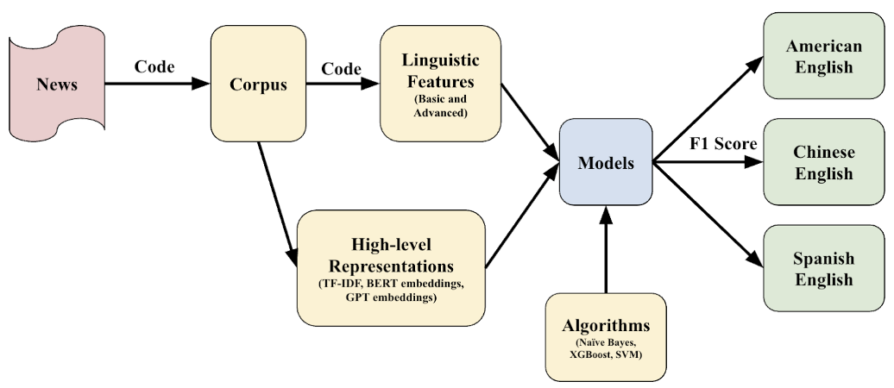
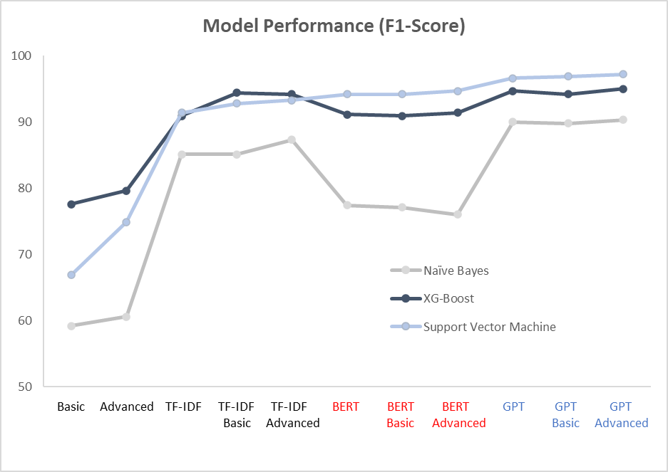

# A-Quantitative-Linguistic-Model-for-English-Variants

### Title:
Can a Quantitative Linguistic Model, Combined with Machine Learning, Classify and Analyze the English Variants? A Case Study in Olympic Journalism

### Abstract:
The field of world English research, studying the global linguistic diversity of English and traditionally relying on qualitative methods, was presented with expanded opportunities following the emergence of advanced language models and machine learning techniques. This study integrates corpus-driven quantitative linguistic methods with qualitative linguistic feature analysis and machine learning algorithms to explore the stylometric differences of English variants in Olympic Journalism. Using a corpus of 1,810 Olympic news articles (2020–2023) in 3 English variants (American, Chinese, and Spanish), a set of models incorporating 164 quantitative linguistic features with advanced language models (TF-IDF, BERT, and GPT embeddings) was developed and evaluated for their performance using various algorithms (Naïve Bayes, XGBoost, and SVM). The research identified the optimal model and revealed a list of linguistic features that distinguish different English variants, both quantitatively and qualitatively. By integrating quantitative models with qualitative feature analysis, this study not only demonstrated the enhanced capability to classify and analyze English variants but paved the way for future research in content localization and personalization. It also evidenced the potential opportunities to expand such an integrated approach in the broader stylometric study and linguistic research. 

---

#### Model Setup and Flow:


#### Quantitative Linguistic Features:
```
Quantitative Metric Formula.docx
```

#### F1-scores outline model performance:

